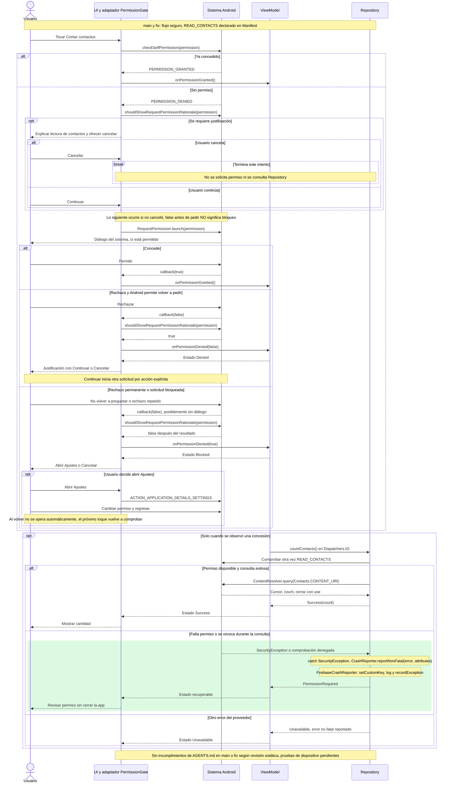
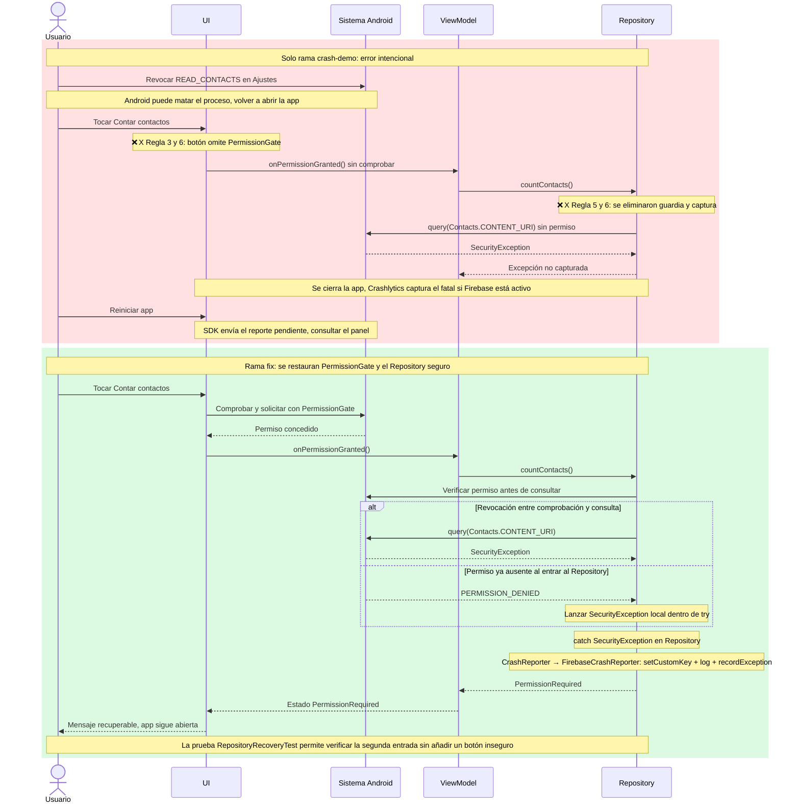

# Diagramas de permisos y Crashlytics

Las fuentes editables están en `permisos.mmd` y `crash-fix.mmd`.

## Flujo de permisos en main y fix

```mermaid
sequenceDiagram
    actor User as Usuario
    participant UI as UI y adaptador PermissionGate
    participant Android as Sistema Android
    participant VM as ViewModel
    participant Repo as Repository

    Note over User,Repo: main y fix: flujo seguro, READ_CONTACTS declarado en Manifest
    User->>UI: Tocar Contar contactos
    UI->>Android: checkSelfPermission(permission)
    alt Ya concedido
        Android-->>UI: PERMISSION_GRANTED
        UI->>VM: onPermissionGranted()
    else Sin permiso
        Android-->>UI: PERMISSION_DENIED
        UI->>Android: shouldShowRequestPermissionRationale(permission)
        opt Se requiere justificación
            UI-->>User: Explicar lectura de contactos y ofrecer cancelar
            alt Usuario cancela
                User->>UI: Cancelar
                break Termina este intento
                    Note over UI,Repo: No se solicita permiso ni se consulta Repository
                end
            else Usuario continúa
                User->>UI: Continuar
            end
        end
        Note over UI,Android: Lo siguiente ocurre si no canceló, false antes de pedir NO significa bloqueo
        UI->>Android: RequestPermission.launch(permission)
        Android-->>User: Diálogo del sistema, si está permitido
        alt Concede
            User->>Android: Permitir
            Android-->>UI: callback(true)
            UI->>VM: onPermissionGranted()
        else Rechaza y Android permite volver a pedir
            User->>Android: Rechazar
            Android-->>UI: callback(false)
            UI->>Android: shouldShowRequestPermissionRationale(permission)
            Android-->>UI: true
            UI->>VM: onPermissionDenied(false)
            VM-->>UI: Estado Denied
            UI-->>User: Justificación con Continuar o Cancelar
            Note over User,Android: Continuar inicia otra solicitud por acción explícita
        else Rechazo permanente o solicitud bloqueada
            User->>Android: No volver a preguntar o rechazo repetido
            Android-->>UI: callback(false), posiblemente sin diálogo
            UI->>Android: shouldShowRequestPermissionRationale(permission)
            Android-->>UI: false después del resultado
            UI->>VM: onPermissionDenied(true)
            VM-->>UI: Estado Blocked
            UI-->>User: Abrir Ajustes o Cancelar
            opt Usuario decide abrir Ajustes
                User->>UI: Abrir Ajustes
                UI->>Android: ACTION_APPLICATION_DETAILS_SETTINGS
                User->>Android: Cambiar permiso y regresar
                Note over User,UI: Al volver no se opera automáticamente, el próximo toque vuelve a comprobar
            end
        end
    end
    opt Solo cuando se observó una concesión
        VM->>Repo: countContacts() en Dispatchers.IO
        Repo->>Android: Comprobar otra vez READ_CONTACTS
        alt Permiso disponible y consulta exitosa
            Repo->>Android: ContentResolver.query(Contacts.CONTENT_URI)
            Android-->>Repo: Cursor, count, cerrar con use
            Repo-->>VM: Success(count)
            VM-->>UI: Estado Success
            UI-->>User: Mostrar cantidad
        else Falta permiso o se revoca durante la consulta
            rect rgb(220, 250, 225)
                Android-->>Repo: SecurityException o comprobación denegada
                Note over Repo: catch SecurityException, CrashReporter.reportNonFatal(error, attributes)
                Note over Repo: FirebaseCrashReporter: setCustomKey, log y recordException
                Repo-->>VM: PermissionRequired
                VM-->>UI: Estado recuperable
                UI-->>User: Revisar permiso sin cerrar la app
            end
        else Otro error del proveedor
            Repo-->>VM: Unavailable, error no fatal reportado
            VM-->>UI: Estado Unavailable
        end
    end
    Note over UI,Repo: Sin incumplimientos de AGENTS.md en main o fix según revisión estática, pruebas de dispositivo pendientes
```

## Fallo deliberado y corrección

```mermaid
sequenceDiagram
    actor User as Usuario
    participant UI as UI
    participant Android as Sistema Android
    participant VM as ViewModel
    participant Repo as Repository

    rect rgb(255, 225, 225)
        Note over User,Repo: Solo rama crash-demo: error intencional
        User->>Android: Revocar READ_CONTACTS en Ajustes
        Note over User,Android: Android puede matar el proceso, volver a abrir la app
        User->>UI: Tocar Contar contactos
        Note over UI: ❌ X Regla 3 y 6: botón omite PermissionGate
        UI->>VM: onPermissionGranted() sin comprobar
        VM->>Repo: countContacts()
        Note over Repo: ❌ X Regla 5 y 6: se eliminaron guardia y captura
        Repo->>Android: query(Contacts.CONTENT_URI) sin permiso
        Android-->>Repo: SecurityException
        Repo-->>VM: Excepción no capturada
        Note over UI,Repo: Se cierra la app, Crashlytics captura el fatal si Firebase está activo
        User->>UI: Reiniciar app
        Note over UI,Android: SDK envía el reporte pendiente, consultar el panel
    end
    rect rgb(220, 250, 225)
        Note over User,Repo: Rama fix: se restauran PermissionGate y el Repository seguro
        User->>UI: Tocar Contar contactos
        UI->>Android: Comprobar y solicitar con PermissionGate
        Android-->>UI: Permiso concedido
        UI->>VM: onPermissionGranted()
        VM->>Repo: countContacts()
        Repo->>Android: Verificar permiso antes de consultar
        alt Revocación entre comprobación y consulta
            Repo->>Android: query(Contacts.CONTENT_URI)
            Android-->>Repo: SecurityException
        else Permiso ya ausente al entrar al Repository
            Android-->>Repo: PERMISSION_DENIED
            Note over Repo: Lanzar SecurityException local dentro de try
        end
        Note over Repo: catch SecurityException en Repository
        Note over Repo: CrashReporter → FirebaseCrashReporter: setCustomKey + log + recordException
        Repo-->>VM: PermissionRequired
        VM-->>UI: Estado PermissionRequired
        UI-->>User: Mensaje recuperable, app sigue abierta
        Note over User,Repo: La prueba RepositoryRecoveryTest permite verificar la segunda entrada sin añadir un botón inseguro
    end
```
